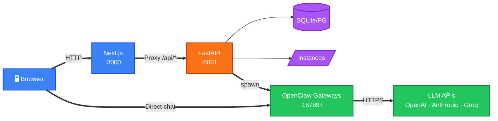

# OpenClaw SAAS

**Multi-tenant AI agent deployment platform.** Deploy production-grade LLM-powered agents in minutes — bring your own API key, configure via UI, run instantly. No DevOps required.

---

## What It Does

OpenClaw SAAS lets you create and manage isolated **AI agent instances**, each powered by the **OpenClaw** Node.js gateway runtime. Each instance:

- Runs as a detached process on its own TCP port
- Connects to any of 30+ LLM providers (OpenAI, Anthropic, Groq, Ollama, and more)
- Has its own configuration, system prompt, uploaded data files, and chat endpoint
- Is isolated per tenant — users only see their own agents

---

## Architecture



---

## Stack

| Layer | Technology |
|-------|-----------|
| Frontend | Next.js 16, React 19, TypeScript, SWR |
| Backend | Python, FastAPI 0.115, Uvicorn, SQLAlchemy |
| Database | SQLite (dev) / PostgreSQL (prod) |
| Auth | JWT HS256, bcrypt, HTTP-only cookies |
| Runtime | OpenClaw (Node.js binary) |
| LLM Support | 30+ providers |

---

## Quick Start

**Terminal 1 — Backend**

```powershell
cd C:\Openclaw_SAAS\backend
.\venv\Scripts\activate
# First time: pip install -r requirements.txt && pip install "pydantic[email]"
copy .env.example .env   # edit PROMPTCLAW_HOME_ROOT with your username
uvicorn main:app --reload --port 8001
```

**Terminal 2 — Frontend**

```powershell
cd C:\Openclaw_SAAS\frontend
# First time: npm install
npm run dev
```

Open **http://localhost:3000** and log in with the admin credentials set in `backend/.env`.

---

## Documentation

| File | Contents |
|------|---------|
| [`docs/01_PRD.md`](docs/01_PRD.md) | Product Requirements — scope, personas, OKRs, logical components, topology |
| [`docs/02_HLD.md`](docs/02_HLD.md) | High-Level Design — network topology, API catalogue, workload paths |
| [`docs/03_Application_Architecture_Design.md`](docs/03_Application_Architecture_Design.md) | Execution flow, layers, config pipeline, process management, ASCII map |
| [`docs/04_Network_Traffic_Flow.md`](docs/04_Network_Traffic_Flow.md) | Port map, sequence diagrams for all major traffic flows |
| [`docs/05_API_Testing_Guide.md`](docs/05_API_Testing_Guide.md) | cURL commands, Postman setup, full smoke test script |
| [`docs/06_Simplified_Architecture_Map.md`](docs/06_Simplified_Architecture_Map.md) | One-page summary, quick cURL reference, environment variables |

---

## Key Environment Variables

| Variable | Description |
|----------|-------------|
| `DATABASE_URL` | `sqlite:///./promptiq.db` (dev) or PostgreSQL URL |
| `JWT_SECRET` | Must be 32+ chars in production |
| `ADMIN_EMAIL` / `ADMIN_PASSWORD` | Seeded admin account |
| `INSTANCES_ROOT` | Workspace directory for agent instances |
| `PROMPTCLAW_HOME_ROOT` | Isolated home directories for gateways |
| `OPENCLAW_ENTRYPOINT` | Path or binary name for the OpenClaw runtime |
| `CORS_ALLOWED_ORIGINS` | Comma-separated list of allowed frontend origins |

---

## API Overview

```
POST   /api/auth/register          Create account
POST   /api/auth/login             Login → JWT
GET    /api/auth/me                Current user

GET    /api/instances              List instances
POST   /api/instances              Create instance
POST   /api/instances/{id}/start   Spawn gateway
POST   /api/instances/{id}/stop    Kill gateway
GET    /api/instances/{id}/config  Get config (masked)
POST   /api/instances/{id}/config  Update config
POST   /api/instances/{id}/upload  Upload data files
GET    /api/instances/{id}/logs    Gateway logs
GET    /health                     Health check
```

Full interactive docs: **http://127.0.0.1:8001/docs**
