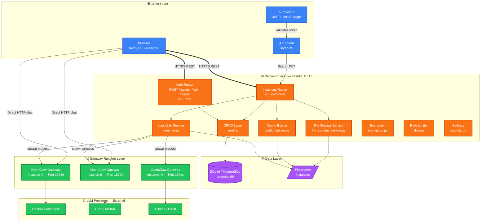
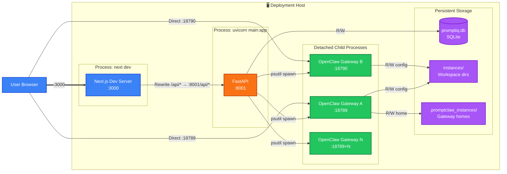

# OpenClaw SAAS — Product Requirements Document
### `docs/01_PRD.md` | Version 1.0 | 2026-06-18

---

## §1 Vision & Purpose

**OpenClaw SAAS** (internally branded *PromptIQ / PromptClaw Manager*) is a **multi-tenant AI agent deployment platform**. It enables developers and business teams to create, configure, and operate production-grade LLM-powered agent instances without writing infrastructure code.

Each **Instance** is an isolated Node.js **OpenClaw gateway** process — a self-contained AI agent runtime that exposes a chat API on a dedicated TCP port, reads its configuration from `promptclaw.json`, and bootstraps its persona from `AGENTS.md`.

> **Core Promise:** *Deploy a fully configured AI agent in under 5 minutes. Bring your own LLM key. Zero DevOps.*

---

## §2 Scope

### In-Scope (Current Release)

| Domain | Capability |
|--------|-----------|
| Authentication | Email/password registration, JWT login, HTTP-only cookie session, 7-day TTL |
| Multi-Tenancy | Per-user tenant isolation; all instance queries scoped to `tenant_id` |
| Instance Lifecycle | Create → Configure → Start → Chat → Stop → Delete |
| LLM Configuration | 30+ providers (OpenAI, Anthropic, Groq, Ollama, etc.) via JSON config |
| Agent Configuration | System prompt (AGENTS.md), tool toggles, plugin toggles, Slack channel |
| File Management | Upload CSV / JSON / XLSX / TXT (≤ 10 MB); agent filesystem access |
| Process Management | Detached gateway process per instance; PID tracking via psutil |
| Config Sanitization | 3-layer masking: DB (raw) → API (masked) → Runtime (sanitized) |
| Rate Limiting | 5 req/min on register; 10 req/min on login via slowapi |
| Health Checks | `/health` and `/health/runtime` endpoints |

### Out-of-Scope (Future Phases)

| Feature | Phase |
|---------|-------|
| RAG / Vector Search Pipeline | Phase 2 |
| Multi-user per Tenant (RBAC) | Phase 2 |
| Billing & Subscriptions (Stripe) | Phase 2 |
| Audit Logging | Phase 2 |
| SSO / SAML | Phase 3 |
| On-premise Kubernetes packaging | Phase 3 |
| MCP full runtime integration | Phase 2 |
| Usage analytics & token metering | Phase 2 |

---

## §3 Logical Components

> **Color legend:** Blue = Client · Orange = Backend · Green = Gateway · Purple = Data

---

## §4 Topology

> Physical and logical layout of running services on a single deployment host.

---

## §5 Functional Requirements

| FR ID | Requirement | Priority | Status |
|-------|------------|----------|--------|
| FR-001 | User registration with email + password (bcrypt, 10 rounds) | P0 | ✅ Done |
| FR-002 | JWT login → HTTP-only cookie + localStorage Bearer | P0 | ✅ Done |
| FR-003 | Tenant-scoped instance isolation on every DB query | P0 | ✅ Done |
| FR-004 | Instance CRUD with auto-incremented port assignment | P0 | ✅ Done |
| FR-005 | Gateway process spawn / stop via psutil | P0 | ✅ Done |
| FR-006 | Config masking: API keys show last 4 chars only | P0 | ✅ Done |
| FR-007 | Config sanitization before runtime write | P0 | ✅ Done |
| FR-008 | File upload (CSV/JSON/XLSX/TXT ≤ 10 MB) with path-traversal guard | P0 | ✅ Done |
| FR-009 | System prompt written to AGENTS.md on instance start | P0 | ✅ Done |
| FR-010 | Secrets encrypted at rest (Fernet AES-256) | P0 | ⚠️ Partial |
| FR-011 | Rate limiting on auth endpoints | P0 | ✅ Done |
| FR-012 | Alembic DB migration scripts | P0 | ❌ Missing |
| FR-013 | Database transactions on multi-step operations | P0 | ❌ Missing |
| FR-014 | Structured JSON logging | P1 | ❌ Missing |
| FR-015 | Audit log table for config changes | P1 | ❌ Missing |

---

## §6 Non-Functional Requirements

| NFR | Target | Category |
|-----|--------|----------|
| API P95 latency | < 200 ms | Performance |
| Instance start time | < 10 s | Performance |
| File upload (10 MB) | < 5 s | Performance |
| Platform uptime | 99.5% (Phase 2) | Reliability |
| Password storage | bcrypt, min 10 rounds | Security |
| Session tokens | HTTP-only, Secure, SameSite=Lax cookie | Security |
| Secrets at rest | AES-256 Fernet | Security |
| Input validation | Pydantic v2 throughout | Security |
| CORS | Explicit allowlist only | Security |

---

## §7 Success Metrics

| Metric | Target | Type |
|--------|--------|------|
| Time-to-first-chat | < 10 minutes from signup | Product |
| Week-4 user retention | > 40% | Product |
| API P95 latency | < 200 ms | Technical |
| Instance start success rate | > 98% | Technical |
| Backend test coverage | > 80% | Technical |
| Zero P0 security incidents post-launch | 0 | Security |
