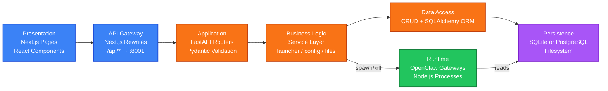
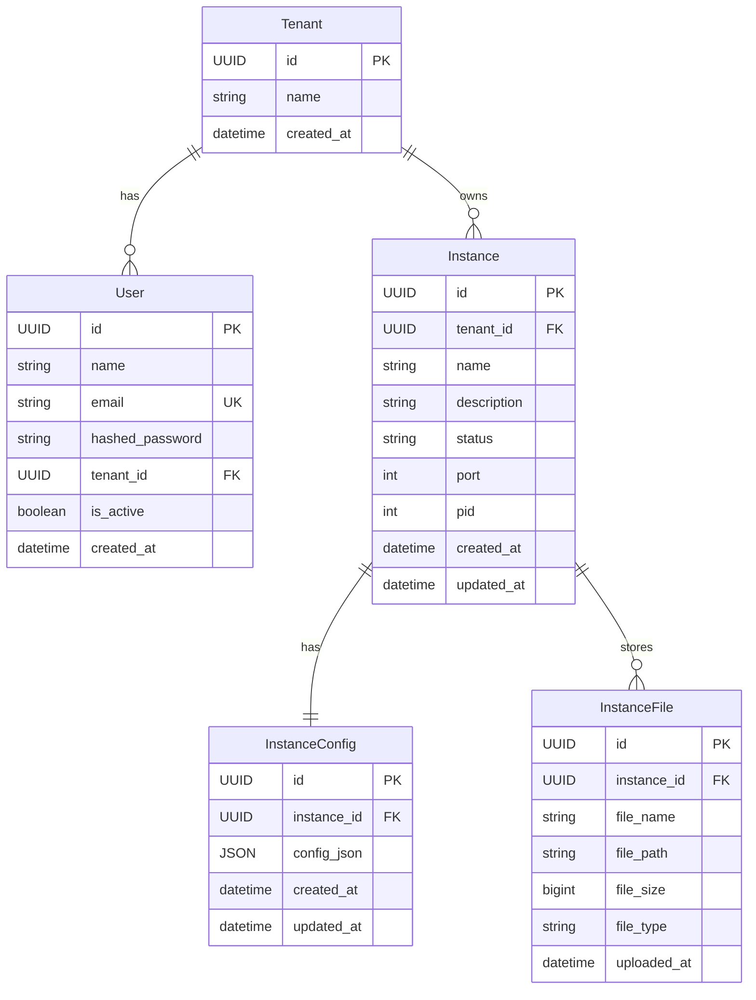
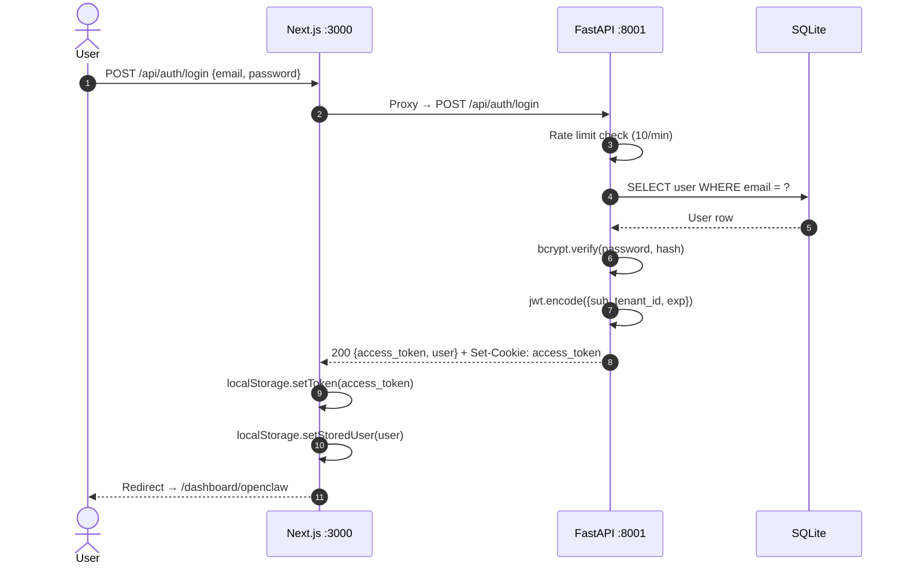
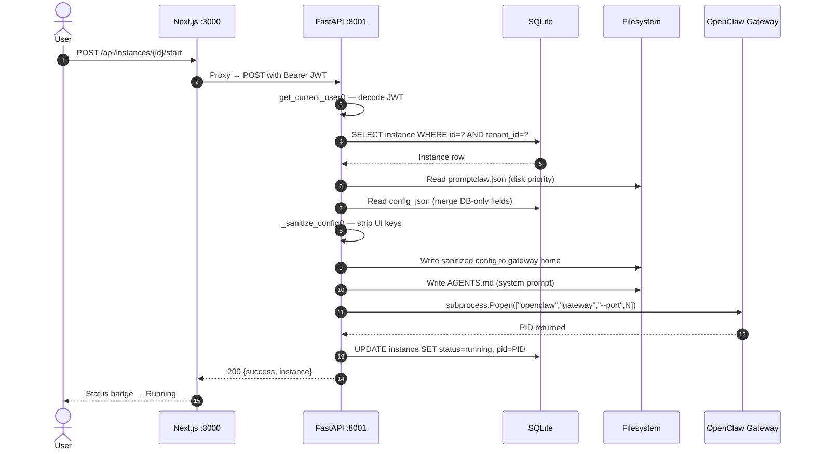
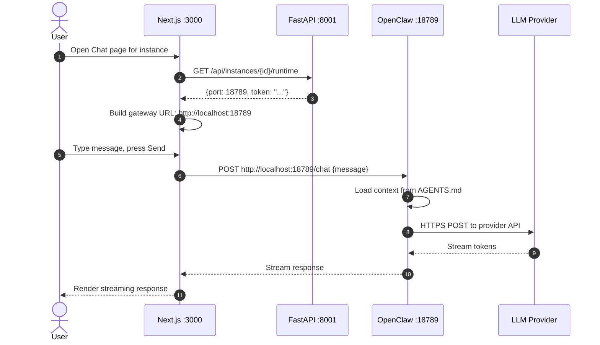
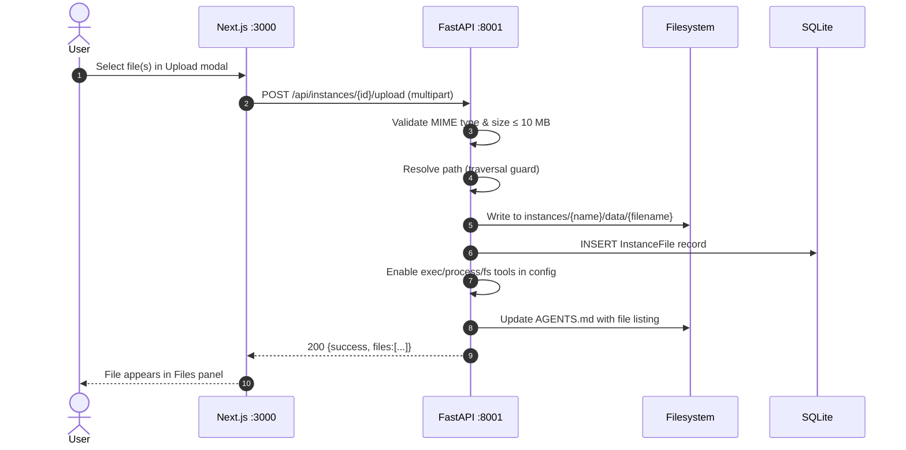

# OpenClaw SAAS — High-Level Design
### `docs/02_HLD.md` | Version 1.0 | 2026-06-18

---

## §1 Network Topology

> End-to-end view of how a browser request travels through the system.

```mermaid
graph TB
    classDef client fill:#3b82f6,stroke:#1d4ed8,stroke-width:2px,color:#fff
    classDef backend fill:#f97316,stroke:#c2410c,stroke-width:2px,color:#fff
    classDef gateway fill:#22c55e,stroke:#15803d,stroke-width:2px,color:#fff
    classDef data fill:#a855f7,stroke:#7e22ce,stroke-width:2px,color:#fff

    BROWSER[🖥️ Browser\nlocalhost:3000]:::client

    subgraph NEXTJS["Next.js — Port 3000"]
        PAGES[Pages & Components]:::client
        REWRITE[next.config.ts\nRewrite /api/* → :8001]:::client
    end

    subgraph FASTAPI["FastAPI — Port 8001"]
        ROUTER_AUTH[/api/auth]:::backend
        ROUTER_INST[/api/instances]:::backend
        MIDDLEWARE[CORS + Rate Limiter\nJWT Extractor]:::backend
    end

    subgraph SERVICES["Service Layer"]
        LAUNCHER[launcher.py\nProcess Manager]:::backend
        CONFIG[config_builder.py\nConfig Sanitizer]:::backend
        FILESVC[file_storage_service.py]:::backend
    end

    subgraph PERSISTENCE["Persistence Layer"]
        DB[(SQLite\npromptig.db)]:::data
        WORKSPACE[instances/{name}/\npromptilaw.json\nAGENTS.md\ngateway.log\ndata/]:::data
        GWHOME[.promptclaw_instances/{name}/\nIsolated gateway home]:::data
    end

    subgraph GATEWAYS["OpenClaw Gateway Processes"]
        GW_A[Port 18789\nInstance A]:::gateway
        GW_B[Port 18790\nInstance B]:::gateway
    end

    subgraph LLMS["External LLM APIs"]
        OAI[OpenAI]:::gateway
        ANT[Anthropic]:::gateway
        GRQ[Groq + 27 others]:::gateway
    end

    BROWSER ==>|"HTTP :3000"| PAGES
    PAGES -->|"SWR fetch /api/*"| REWRITE
    REWRITE ==>|"Proxy HTTP :8001"| MIDDLEWARE
    MIDDLEWARE --> ROUTER_AUTH
    MIDDLEWARE --> ROUTER_INST
    ROUTER_INST --> SERVICES
    SERVICES --> PERSISTENCE
    LAUNCHER -->|"subprocess.Popen"| GW_A
    LAUNCHER -->|"subprocess.Popen"| GW_B
    BROWSER ==>|"Direct HTTP :18789"| GW_A
    BROWSER ==>|"Direct HTTP :18790"| GW_B
    GW_A -->|"HTTPS"| OAI
    GW_B -->|"HTTPS"| ANT
    GW_A -->|"HTTPS"| GRQ
```

---

## §2 Technology Stack

### Backend

| Component | Technology | Version |
|-----------|-----------|---------|
| Web Framework | FastAPI | 0.115.5 |
| ASGI Server | Uvicorn | 0.32.1 |
| ORM | SQLAlchemy | 1.4.54 |
| Database (dev) | SQLite | — |
| Database (prod) | PostgreSQL | — |
| Migrations | Alembic | 1.13.1 |
| Auth | python-jose (JWT HS256) | 3.3.0 |
| Password Hashing | passlib + bcrypt | 1.7.4 / 3.2.2 |
| Validation | Pydantic v2 | 2.10.3 |
| Rate Limiting | slowapi | 0.1.9 |
| Process Monitor | psutil | 6.1.0 |
| HTTP Client | httpx | 0.28.0 |
| Encryption | cryptography (Fernet) | 43.0.3 |
| Config | python-dotenv | 1.0.1 |

### Frontend

| Component | Technology | Version |
|-----------|-----------|---------|
| Framework | Next.js | 16.2.4 |
| UI Library | React | 19.2.4 |
| Data Fetching | SWR | 2.4.1 |
| Icons | Lucide React | 1.8.0 |
| Notifications | react-hot-toast | 2.6.0 |
| Language | TypeScript | 5.x |
| Styling | CSS Modules + inline styles | — |

### Runtime

| Component | Technology |
|-----------|-----------|
| Agent Runtime | OpenClaw (Node.js binary) |
| Gateway Command | `openclaw gateway --port {N} --allow-unconfigured` |
| Config File | `promptclaw.json` (JSON) |
| System Prompt | `AGENTS.md` (Markdown) |

---

## §3 Application Layers



---

## §4 Component Breakdown

### Backend Modules

| Module | File | Responsibility |
|--------|------|---------------|
| Entry Point | `main.py` | FastAPI app init, lifespan hooks, admin seed, CORS, router registration |
| Auth Utilities | `auth.py` | JWT create/decode, bcrypt hash/verify, `get_current_user` dependency |
| Auth Router | `routers/auth.py` | `/register`, `/login`, `/logout`, `/me` |
| Instances Router | `routers/instances.py` | 20+ instance management endpoints |
| CRUD | `crud.py` | All DB read/write ops, config masking, UI field attachment |
| Database | `database.py` | SQLAlchemy engine, `SessionLocal`, `get_db` dependency |
| Models | `models.py` | ORM: User, Tenant, Instance, InstanceConfig, InstanceFile |
| Schemas | `schemas.py` | Pydantic v2 request/response models |
| Settings | `settings.py` | Frozen dataclass config from ENV vars |
| Limiter | `limiter.py` | slowapi `Limiter` instance |
| Launcher | `services/launcher.py` | `start_instance`, `stop_instance`, `is_instance_running` |
| Config Builder | `services/config_builder.py` | `activate_instance`, `_sanitize_config`, `load_disk_config` |
| File Storage | `services/file_storage_service.py` | Upload, list, delete, path-traversal guard |
| Encryption | `services/encryption.py` | Fernet key management |

### Frontend Modules

| Module | Path | Responsibility |
|--------|------|---------------|
| Root Layout | `app/layout.tsx` | `<Toaster>` provider, global CSS |
| Home | `app/page.tsx` | Redirect to `/dashboard/openclaw` |
| Login | `app/login/page.tsx` | Email/password form, JWT storage |
| Register | `app/register/page.tsx` | Account creation form |
| Dashboard | `app/dashboard/openclaw/page.tsx` | Instance grid, SWR polling |
| Instance Detail | `app/dashboard/openclaw/[id]/page.tsx` | Single instance view |
| Chat | `app/dashboard/openclaw/[id]/chat/page.tsx` | WebChat via gateway URL |
| Configure | `app/dashboard/openclaw/[id]/configure/page.tsx` | Config editor |
| AuthGuard | `components/AuthGuard.tsx` | JWT check, redirect to login |
| InstanceCard | `components/InstanceCard.tsx` | Status, start/stop, logs |
| ConfigForm | `components/ConfigForm.tsx` | Provider, model, tools, Slack tabs |
| API Client | `lib/api.ts` | Typed `fetch` wrapper, all endpoint methods |
| Auth Utils | `lib/auth.ts` | `getToken`, `setToken`, `getAuthHeaders`, `isLoggedIn` |
| Runtime | `lib/runtime.ts` | Gateway URL builder |

---

## §5 Database Schema



---

## §6 API Endpoint Catalogue

### Auth — `/api/auth`

| Method | Path | Description | Auth Required |
|--------|------|-------------|---------------|
| `POST` | `/api/auth/register` | Create user + tenant, issue JWT | No |
| `POST` | `/api/auth/login` | Verify credentials, issue JWT | No |
| `POST` | `/api/auth/logout` | Clear auth cookie | No |
| `GET` | `/api/auth/me` | Return current user | Yes |

### Instances — `/api/instances`

| Method | Path | Description | Auth Required |
|--------|------|-------------|---------------|
| `GET` | `/api/instances` | List tenant's instances | Yes |
| `POST` | `/api/instances` | Create new instance | Yes |
| `GET` | `/api/instances/{id}` | Get instance detail | Yes |
| `DELETE` | `/api/instances/{id}` | Delete instance + all data | Yes |
| `POST` | `/api/instances/{id}/start` | Spawn gateway process | Yes |
| `POST` | `/api/instances/{id}/stop` | Kill gateway process | Yes |
| `GET` | `/api/instances/{id}/config` | Get config (masked secrets) | Yes |
| `POST` | `/api/instances/{id}/config` | Update config | Yes |
| `POST` | `/api/instances/{id}/config/apply-fixes` | Apply canonical schema fixes | Yes |
| `POST` | `/api/instances/{id}/reset` | Reset to default template | Yes |
| `GET` | `/api/instances/{id}/runtime` | Get port + auth token | Yes |
| `GET` | `/api/instances/{id}/logs` | Get gateway.log contents | Yes |
| `GET` | `/api/instances/{id}/files` | List uploaded files | Yes |
| `POST` | `/api/instances/{id}/upload` | Upload data files | Yes |
| `DELETE` | `/api/instances/{id}/files/{file_id}` | Delete uploaded file | Yes |

### Health

| Method | Path | Description |
|--------|------|-------------|
| `GET` | `/health` | Basic health check |
| `GET` | `/health/runtime` | Node.js, OpenClaw, storage status |

---

## §7 Workload Paths

### Path A — User Login



### Path B — Instance Start



### Path C — Chat with Agent



### Path D — File Upload


