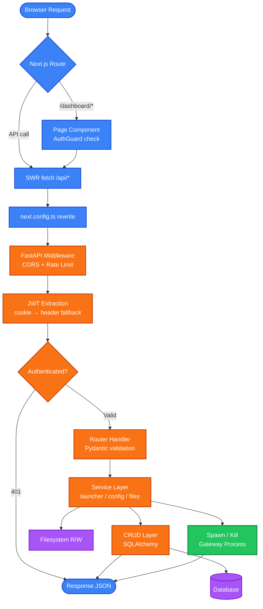
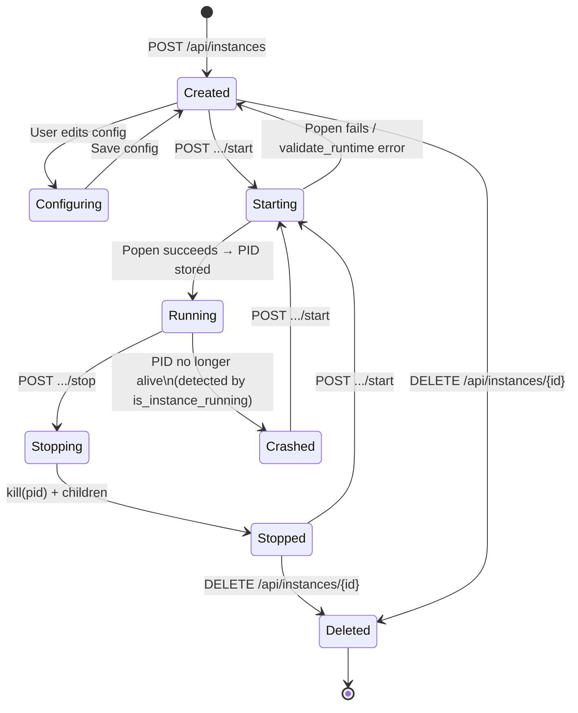

# OpenClaw SAAS — Application Architecture Design
### `docs/03_Application_Architecture_Design.md` | Version 1.0 | 2026-06-18

---

## §1 Architecture Overview

OpenClaw SAAS follows a **3-tier architecture** with an additional **detached runtime layer**:

```
┌─────────────────────────────────────────────────────────────────┐
│  TIER 1 — PRESENTATION                                          │
│  Next.js 16 + React 19  (Port 3000)                             │
│  Pages / Components / SWR / localStorage JWT                    │
└────────────────────────┬────────────────────────────────────────┘
                         │  HTTP via next.config.ts rewrites
┌────────────────────────▼────────────────────────────────────────┐
│  TIER 2 — APPLICATION                                           │
│  FastAPI 0.115 + Uvicorn  (Port 8001)                           │
│  Routers → Services → CRUD → SQLAlchemy ORM                     │
└─────────┬──────────────────────────────────┬────────────────────┘
          │ SQLAlchemy                        │ subprocess.Popen
┌─────────▼───────────────┐    ┌─────────────▼────────────────────┐
│  TIER 3 — PERSISTENCE   │    │  TIER 4 — RUNTIME                │
│  SQLite / PostgreSQL     │    │  OpenClaw Gateway Processes      │
│  Filesystem (instances/) │    │  Ports 18789, 18790, 187xx...    │
└─────────────────────────┘    └──────────────────────────────────┘
```

---

## §2 Execution Flow — Request Lifecycle



---

## §3 Authentication Architecture

### Token Flow

```
REGISTER / LOGIN
    │
    ├── bcrypt.verify (10 rounds ≈ 60 ms)
    │
    ├── jwt.encode({sub: user_id, tenant_id, exp: +7days}, SECRET_KEY, HS256)
    │
    ├── response.set_cookie(access_token, httpOnly=True, samesite=lax)
    │
    └── return {access_token: <token>, user: {...}}
                │
                └── Frontend: localStorage.setItem("promptiq_auth_token", token)

SUBSEQUENT REQUESTS
    │
    ├── _extract_token(request):
    │       1. request.cookies.get("access_token")   ← HTTP-only cookie
    │       2. Authorization: Bearer <token>          ← localStorage fallback
    │
    └── jwt.decode(token, SECRET_KEY) → {sub, tenant_id}
            │
            └── db.query(User).filter(User.id == sub).first()
```

### AuthGuard (Frontend)

```
AuthGuard.useEffect:
    token = localStorage.getItem("promptiq_auth_token")
    user  = localStorage.getItem("promptiq_user")

    if (!token || !user) → router.replace("/login")
    else                 → render children(user)
```

---

## §4 Instance Lifecycle State Machine



---

## §5 Config Sanitization Pipeline

The system maintains **three distinct config representations** to balance security, UI usability, and runtime correctness:

```
DATABASE (raw)
  config_json = {
    "agents.defaults.systemPrompt": "You are ...",   ← UI-only
    "agents.defaults.mcp": {...},                    ← UI-only
    "tools.exec.enabled": true,                      ← UI-only
    "models.providers.openrouter.apiKey": "sk-..."   ← plaintext
  }
        │
        │  crud.get_instance_config(mask=True)
        ▼
API RESPONSE (masked)
  config_json = {
    ...same structure...
    "models.providers.openrouter.apiKey": "****...XXXX"  ← last 4 shown
  }
        │
        │  config_builder._sanitize_config()
        ▼
RUNTIME (sanitized) — written to promptclaw.json
  config_json = {
    NO systemPrompt       ← written to AGENTS.md instead
    NO mcp                ← stripped
    NO tools.exec.enabled ← stripped
    "models.mode": "replace"           ← forced
    "tools.exec.enabled": false        ← normalized
    "plugins.slack.enabled": false     ← normalized
    ...clean config OpenClaw accepts...
  }
```

---

## §6 File Storage Architecture

```
POST /api/instances/{id}/upload
         │
         ├── Validate: MIME ∈ {text/csv, application/json, xlsx, text/plain}
         ├── Validate: size ≤ 10 MB
         ├── Sanitize filename
         ├── Resolve path → must stay under instances/{name}/data/
         ├── Write file to disk
         ├── INSERT InstanceFile (DB)
         ├── Enable tools.exec / tools.process / tools.fs in config
         └── Rewrite instances/{name}/AGENTS.md with file listing

File Listing in AGENTS.md:
  ## Available Data Files
  - data/employees.csv (45.2 KB)
  - data/policies.json (12.1 KB)

DELETE /api/instances/{id}/files/{file_id}
         │
         ├── Verify ownership (tenant_id check)
         ├── DELETE InstanceFile (DB)
         └── os.remove(file_path)
```

---

## §7 Process Management Architecture

```
start_instance(name, id, port):
    │
    ├── settings.validate_runtime(require_openclaw=True)
    ├── os.makedirs(instance_dir)
    ├── Resolve instance_home:
    │     preferred → PROMPTCLAW_HOME_ROOT/{safe_name}/
    │     fallback  → instances/{name}/.promptclaw-home/
    ├── shutil.copyfile(promptclaw.json → instance_home/promptclaw.json)
    ├── cmd = ["openclaw", "gateway", "--port", str(port), "--allow-unconfigured"]
    ├── env["OPENCLAW_HOME"] = instance_home
    ├── env["OPENCLAW_CONFIG_PATH"] = config_dst
    ├── env["NODE_OPTIONS"] = "--dns-result-order=ipv4first"
    ├── Windows: Popen(..., creationflags=CREATE_NEW_PROCESS_GROUP|CREATE_NO_WINDOW)
    │   Linux:  Popen(..., start_new_session=True)
    ├── stdout/stderr → gateway.log (append, line-buffered)
    └── return process.pid

stop_instance(pid):
    │
    ├── parent = psutil.Process(pid)
    ├── for child in parent.children(recursive=True): child.kill()
    └── parent.kill()

is_instance_running(pid):
    └── psutil.Process(pid).is_running() and status != ZOMBIE
```

---

## §8 Multi-Tenancy Isolation Model

```
Every DB query in crud.py filters by tenant_id:

    db.query(Instance)
      .filter(Instance.tenant_id == current_user.tenant_id)
      .all()

Filesystem isolation:
    instances/{instance_name}/        ← workspace (per instance, shared name-space)
    .promptclaw_instances/{name}/     ← gateway home (truly isolated)

Port isolation:
    Each instance gets a unique port assigned at creation:
    port = max(existing_ports) + 1, min = INSTANCE_BASE_PORT (18789)

Process isolation:
    Each gateway runs as a separate OS process with its own:
    - OPENCLAW_HOME directory
    - OPENCLAW_CONFIG_PATH
    - TCP port
```

---

## §9 ASCII Architecture Map

```
C:\Openclaw_SAAS\
│
├── backend\                          Python FastAPI Application
│   ├── main.py                       App entry point, lifespan, seed admin
│   ├── auth.py                       JWT encode/decode, get_current_user
│   ├── models.py                     SQLAlchemy ORM: User/Tenant/Instance/Config/File
│   ├── schemas.py                    Pydantic v2 request/response models
│   ├── crud.py                       All DB operations (26 KB)
│   ├── database.py                   Engine + SessionLocal + get_db
│   ├── settings.py                   Frozen ENV-driven config dataclass
│   ├── limiter.py                    slowapi Limiter instance
│   ├── routers\
│   │   ├── auth.py                   POST /register /login /logout; GET /me
│   │   └── instances.py              20+ instance endpoints (540 lines)
│   └── services\
│       ├── launcher.py               start_instance / stop_instance / is_running
│       ├── config_builder.py         activate_instance / _sanitize_config
│       ├── file_storage_service.py   upload / list / delete files
│       └── encryption.py             Fernet key utilities
│
├── frontend\                         Next.js 16 TypeScript Application
│   ├── next.config.ts                Rewrite /api/* → http://127.0.0.1:8001
│   ├── app\
│   │   ├── layout.tsx                Root layout + Toaster
│   │   ├── page.tsx                  Redirect to /dashboard/openclaw
│   │   ├── login\page.tsx            Login form
│   │   ├── register\page.tsx         Registration form
│   │   └── dashboard\openclaw\
│   │       ├── page.tsx              Instance grid (SWR)
│   │       └── [id]\
│   │           ├── page.tsx          Instance detail
│   │           ├── chat\page.tsx     Chat interface → gateway
│   │           └── configure\page.tsx  Config editor
│   ├── components\
│   │   ├── AuthGuard.tsx             JWT check + redirect
│   │   ├── InstanceCard.tsx          Card UI + start/stop/logs
│   │   ├── ConfigForm.tsx            LLM / Slack / Prompt / Tools tabs
│   │   ├── ConfigViewer.tsx          JSON modal
│   │   ├── CreateInstanceModal.tsx   New instance dialog
│   │   ├── UploadDataModal.tsx       File upload
│   │   └── LogsViewer.tsx            gateway.log display
│   └── lib\
│       ├── api.ts                    Typed fetch wrapper
│       ├── auth.ts                   localStorage token management
│       └── runtime.ts               Gateway URL builder
│
└── instances\                        Gateway Workspaces (runtime)
    ├── Chatbot\
    │   ├── promptclaw.json           Runtime config (sanitized)
    │   ├── AGENTS.md                 System prompt
    │   ├── gateway.log               Process stdout/stderr
    │   ├── package.json              Prevents find-up escape
    │   └── data\                     Uploaded files
    └── HR-Bot\
        └── ...                       Same structure
```
