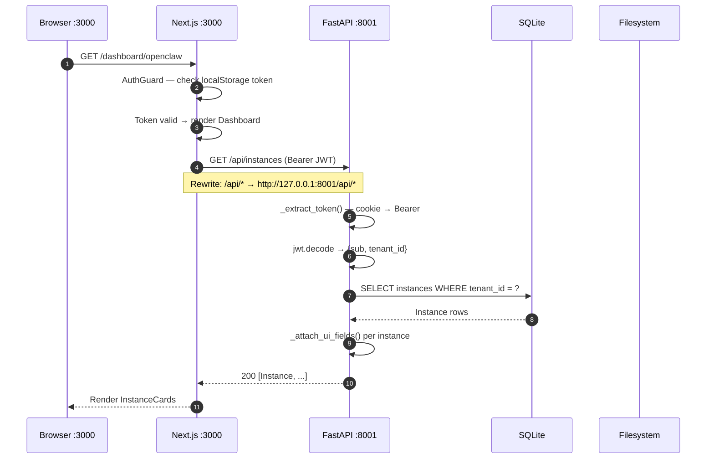
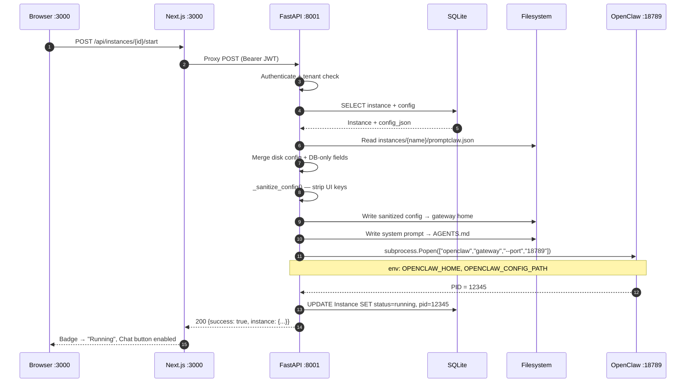
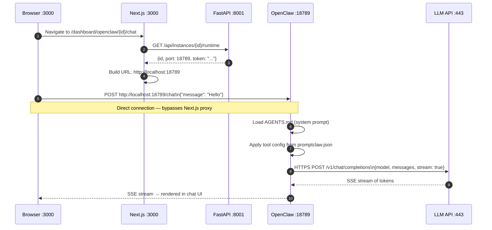
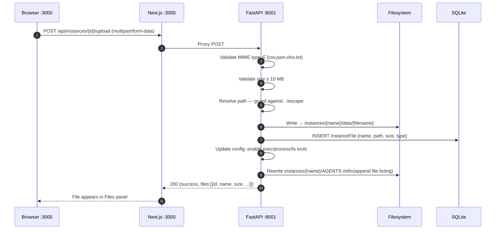
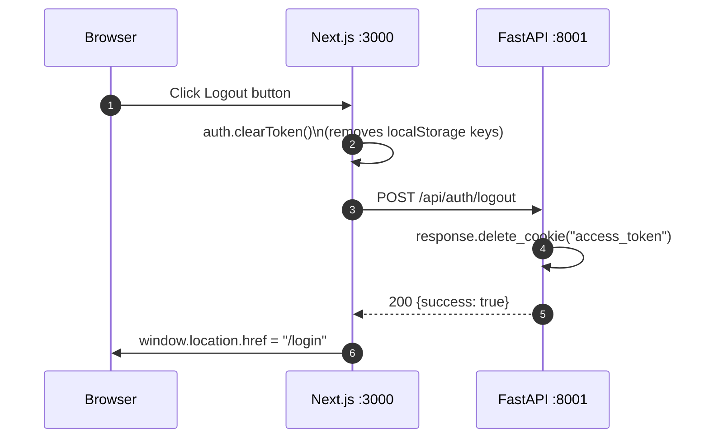

# OpenClaw SAAS — Network & Traffic Flow
### `docs/04_Network_Traffic_Flow.md` | Version 1.0 | 2026-06-18

---

## §1 Port Map

| Service | Host | Port | Protocol | Notes |
|---------|------|------|----------|-------|
| Next.js Dev Server | localhost | 3000 | HTTP | Frontend — `npm run dev` |
| FastAPI / Uvicorn | 127.0.0.1 | 8001 | HTTP | Backend — `uvicorn main:app` |
| OpenClaw Gateway (base) | 127.0.0.1 | 18789 | HTTP | First instance |
| OpenClaw Gateway (+1) | 127.0.0.1 | 18790 | HTTP | Second instance |
| OpenClaw Gateway (+N) | 127.0.0.1 | 18789+N | HTTP | Nth instance |
| LLM Providers | external | 443 | HTTPS | OpenAI, Anthropic, Groq, etc. |

---

## §2 Full Traffic Flow — Dashboard Load



---

## §3 Traffic Flow — Instance Start



---

## §4 Traffic Flow — Chat Session



---

## §5 Traffic Flow — File Upload



---

## §6 Traffic Flow — Logout



---

## §7 CORS & Security Headers

```
Allowed Origins (CORS_ALLOWED_ORIGINS env):
  Development: http://localhost:3000, http://127.0.0.1:3000
  Production:  set explicitly — no wildcard

Rate Limiting (slowapi):
  POST /api/auth/register  → 5 requests / minute / IP
  POST /api/auth/login     → 10 requests / minute / IP

Cookie Security:
  name:     access_token
  httpOnly: True              (JS cannot read)
  samesite: lax
  secure:   True only if APP_ENV=production
  max_age:  10080 * 60 seconds (7 days)

JWT:
  algorithm: HS256
  payload:   {sub: user_id, tenant_id, exp}
  secret:    JWT_SECRET env var (must be 32+ chars in production)
```

---

## §8 Network Isolation Model

```
┌────────────────────────────────────────────────────┐
│  TRUSTED ZONE (loopback 127.0.0.1)                 │
│                                                    │
│  Browser ──────→ Next.js :3000                     │
│                       │                            │
│                       │ rewrite                    │
│                       ▼                            │
│               FastAPI :8001                        │
│                   │       │                        │
│                   │       └──→ Gateway :18789       │
│                   │       └──→ Gateway :18790       │
│                   ▼                                │
│              SQLite DB                             │
│              Filesystem                            │
│                                                    │
└────────────────────────────────────────────────────┘
                    │ HTTPS only
┌────────────────────────────────────────────────────┐
│  EXTERNAL ZONE (internet)                          │
│  LLM Provider APIs (OpenAI, Anthropic, Groq, ...)  │
└────────────────────────────────────────────────────┘

Note: LLM API keys travel:
  Browser → (never exposed)
  FastAPI → (stored in DB, masked in API responses)
  Gateway → (reads from promptclaw.json at startup)
  LLM API → (sent via HTTPS in Authorization header)
```
